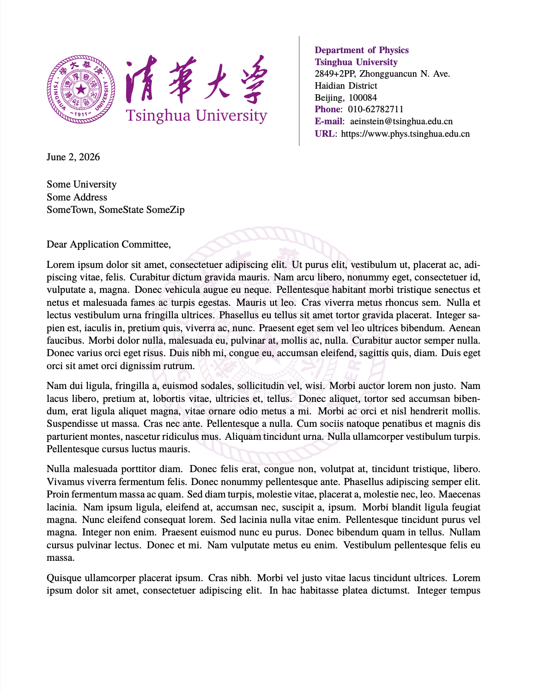

# Tsinghua Letter Template

An unofficial XeLaTeX letter template with a Tsinghua-style header, purple theme color, Chinese support, and a faint logo watermark on every page.

## Build

Requires a TeX distribution with `latexmk` and XeLaTeX.

```sh
make
make clean
make cleanall
```

`make` builds the watermark PDF if needed, then builds `main.pdf`. `make clean` removes LaTeX auxiliary files and keeps generated PDFs. `make cleanall` also removes generated PDFs.

## Example



## Files

- `main.tex`: letter content, sender information, fonts, page numbering, and watermark placement.
- `custom_letter.cls`: letter class and first-page letterhead layout.
- `full_logo.pdf`: header logo.
- `logo.pdf`: source logo used to generate the faded watermark.
- `watermark/`: standalone watermark source and generated watermark PDF.
- `signature.pdf`: optional signature image.

## License

This project is licensed under the Creative Commons Attribution 4.0 International (CC BY 4.0) license, see [LICENSE](LICENSE).
The source comments preserve attribution for earlier template code. University logos, trademarks, and signature images may have separate rights.
